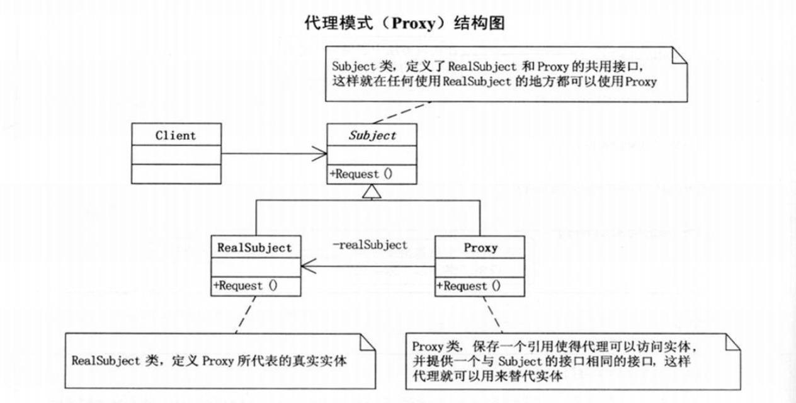

# 代理模式
## 定义
为其他对象提供一种代理以控制对这个对象的访问

- Subject类，定义了RealSubject和Proxy的共有接口，保证在任何使用RealSubject的地方可以使用Proxy
- RealSubject类，定义了Proxy所代表的真实实体
- Proxy类，保存一个引用使得代理可以访问实体，并提供一个与Subject的接口相同的接口
## 应用
1. 远程代理
为一个对象在不同的地址空间提供局部代表。这样可以隐藏一个对象存在于不同地址空间的事实（webservice）
2. 虚拟代理
根据需要创建开销很大的对象。通过它来存放实例化需要很长时间的真实对象（例如，HTML网页加载时的图片资源）
3. 安全代理
用来控制真实对象访问时的权限（不同的对象有不同的访问权限时）
4. 智能指引
当调用真实的对象时，代理处理另外一些事（如计算真实对象的引用次数；在访问一个对象前，检查是否已经锁定它；在第一次引用一个对象时，将它装入内存）
## 总结
代理模式就是在访问对象时引入一定程度的间接性，由于这种间接性，可以附加多种用途